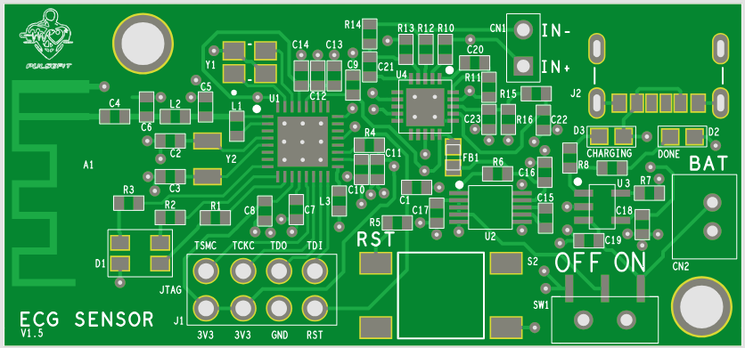
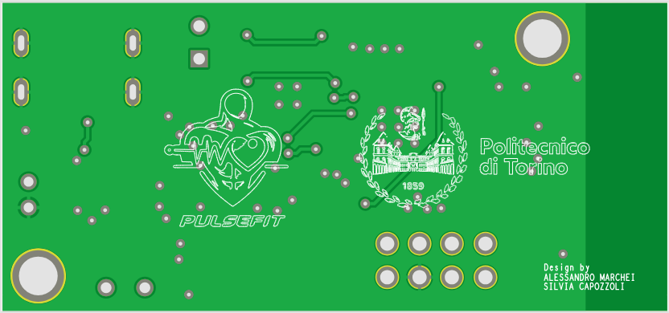

# PulseFit - Wearable ECG Sensor and Fitness Tracker

**PulseFit** is a compact, energy-efficient, and wearable ECG monitoring device designed for sports and fitness enthusiasts. The project integrates cutting-edge hardware, efficient circuit design, and robust BLE communication to deliver real-time heart rate monitoring in an easy-to-use format. The device is ideal for users looking to track their cardiovascular health during physical activity.

---

## **Table of Contents**
1. [Project Overview](#project-overview)
2. [Key Features](#key-features)
3. [System Overview](#system-overview)
4. [Hardware Components](#hardware-components)
   - [ECG Sensor](#ecg-sensor)
   - [Microcontroller](#microcontroller)
   - [Power Management](#power-management)
   - [Peripherals](#peripherals)
5. [PCB Design](#pcb-design)
6. [Power Consumption Analysis](#power-consumption-analysis)
7. [Bill of Materials (BOM) and Cost](#bill-of-materials-bom-and-cost)
8. [Usage Instructions](#usage-instructions)
9. [Development and Design History](#development-and-design-history)
10. [Contributors](#contributors)

---

## **Project Overview**
PulseFit is a wearable chest strap designed to monitor ECG signals and transmit data wirelessly to a connected device. The device leverages an **AD8232 ECG sensor** for accurate biopotential signal acquisition and a **CC2640 microcontroller** for data processing and BLE communication. With a battery life of over 40 hours, PulseFit balances functionality, portability, and cost, making it ideal for fitness tracking.

---

## **Key Features**
- **Advanced ECG Monitoring**: High-gain AD8232 sensor tailored for real-time heart rate analysis.
- **BLE Communication**: Integrates BLE 5.0 for seamless data transmission to smartphones or fitness devices.
- **Compact and Lightweight**: PCB dimensions of 5.1 x 2.39 cm, designed for user comfort.
- **Rechargeable and Sustainable**: LiPo battery with USB charging, providing up to 40 hours of use on a single charge.
- **User Feedback**: RGB and charge status LEDs for clear device status indication.
- **Robust Design**: Operates efficiently in extreme environments (-40°C to +85°C).

---

## **System Overview**
The PulseFit system includes the following subsystems:
1. **Signal Acquisition**:
   - Captures ECG signals using the AD8232 sensor.
   - Optimized for minimal interference and high signal integrity.
2. **Data Processing**:
   - Processes signals with the CC2640 ARM Cortex-M3 microcontroller.
   - Converts analog signals to digital values for BLE transmission.
3. **Power Management**:
   - Voltage regulator (**MAX1759EUB**) adapts battery voltage to 3.3V.
   - LiPo battery with USB recharging and thermal protection.
4. **User Interaction**:
   - RGB LED for operational feedback and Red/Green LEDs for charge status.
5. **Wireless Communication**:
   - A 2.4 GHz BLE antenna ensures efficient and reliable data transmission.

---

## **Hardware Components**
### **ECG Sensor**
- **Model**: AD8232
- **Purpose**: Captures biopotential signals with minimal interference.
- **Configuration**: "Next-to-Heart" mode for enhanced cardiac signal strength.
- **Specifications**:
  - Low supply current: 170µA
  - Shutdown mode: 40nA
  - Integrated right-leg drive amplifier
  - High CMRR: 80 dB
- **Advantages**: Compact design with minimal external components for noise reduction.

### **Microcontroller**
- **Model**: CC2640 (Texas Instruments)
- **Core**: ARM Cortex-M3 @ 48 MHz.
- **Features**:
  - Integrated BLE 5.0 controller.
  - Ultra-low power standby mode (1.5µA).
  - Analog-to-Digital Converter (ADC) for ECG signal processing.
- **I/O**:
  - Dedicated GPIO for RGB LEDs and ECG sensor control.
  - JTAG interface for debugging.

### **Power Management**
- **Battery**: LP402025 LiPo (150mAh).
- **Charger**: MCP73831 USB charger with constant-current/voltage control.
- **Voltage Regulator**: MAX1759EUB for stable 3.3V output.
- **LED Indicators**:
  - Red: Charging.
  - Green: Fully charged.

### **Peripherals**
- **Electrodes**: Gold-plated, dry electrodes for superior signal quality and durability.
- **Antenna**: 2.4 GHz patch antenna for BLE communication.
- **Buttons**: Reset button and power slide switch.

---

## **PCB Design**
### **Layout Highlights**
- **Dimensions**: 5.1 x 2.39 cm.
- **Component Placement**:
  - Antenna positioned for minimal interference.
  - ECG sensor placed close to the microcontroller for short signal paths.
  - Power components grouped together for efficient routing.
- **Routing**:
  - Trace width: 0.25 mm to minimize impedance.
  - Class 5C compliance for manufacturing standards.
- **Ground Plane**:
  - Provides noise shielding for critical components.

---

## **Power Consumption Analysis**
Average power consumption:
- **Microcontroller**: 3.02mA.
- **ECG Sensor**: 0.17mA.
- **RGB LEDs**: 0.51mA.
- **Estimated Battery Life**: ~40 hours (150mAh battery).

---

## **Bill of Materials (BOM) and Cost**
### **Cost Breakdown**
| Quantity | PCB (€) | Components (€) | Electrodes (€) | Stencil (€) | Total (€) |
|----------|---------|----------------|----------------|-------------|-----------|
| 1        | 38.83   | 30.58          | 18.20          | -           | 87.61     |
| 10       | 6.84    | 24.52          | 18.20          | -           | 49.56     |
| 100      | 1.80    | 19.38          | 18.20          | 0.33        | 39.71     |
| 1000     | 0.74    | 19.38          | 18.20          | 0.033       | 38.35     |

---

## **Usage Instructions**
1. **Setup**:
   - Charge the device via USB.
   - Attach the chest strap securely with electrodes in place.
2. **Operation**:
   - Power on using the slide switch.
   - Observe RGB LED indicators for device status.
   - Pair with a BLE-compatible device to monitor ECG data.
3. **Maintenance**:
   - Clean electrodes after use.
   - Recharge battery as needed.

In this project, the main files are the following:

- A **project** directory with 2 subfolders : 
	- "Temp" directory contains the entire project, both the Capture project and the Allegro board

	- "ORCAD_PERSONAL_LIBRARY" contains every .OLB for the schematic libraries, every footprint contained in the board and relative .psm in the subfolder "FOOTPRINTS" and every padstack (.pad) in the "PADSTACK" folder.

- The **REPORT** of the project (.pdf)

- The **BOM** containing every cost related to the device, with every price based on the purchase quantity (.xslx)

- The **video demo** of the project (.mp4)

- **Slides** of the video demo (.pdf)

---

## **Development and Design History**
### **Version Highlights**
- **v1.1**: Initial schematic and PCB design.
- **v1.2**: Introduced slide switch for improved usability.
- **v1.3**: Optimized electrode connectivity.
- **v1.4**: Improved component spacing and reduced manufacturing costs.
- **v1.5**: Added mounting holes for secure casing attachment.

---

## **Contributors**
- [Alessandro Marchei](https://github.com/alessandromarchei)
- Silvia Capozzoli

For full documentation and design files, please refer to the `docs` folder.

